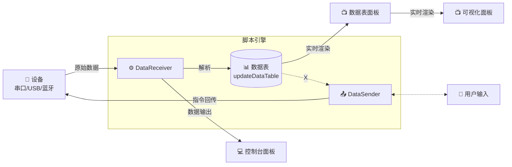

## 数据流转流程

数据流转遵循以下步骤：




- **📝 用户输入** → 🔌 发送面板 → 📤 DataSender → 📡 设备（发送流程）
- 📡 设备 → ⚙️ DataReceiver → 📊 数据表 → 📺 数据表面板 / 📈 图表面板 / 💻 终端日志（接收流程）

### 流程说明

| 区域 | 说明 |
|------|------|
| 📡 设备层 | 物理设备通信层，支持串口、WebUSB、蓝牙、WebSocket 等 |
| 🔧 脚本引擎 | 用户编写 JavaScript 代码的区域，包含 `DataReceiver`、`DataSender`、`updateDataTable` |
| 📺 显示与发送 | 数据展示区域（数据表、图表、终端日志）和用户发送控制 |

### 1. 数据采集

设备（串口/USB/蓝牙等）采集数据，通过串口通信将原始数据传输到应用程序。

### 2. 脚本处理

数据进入脚本的 `DataReceiver` 函数进行处理：

- 每次串口收到数据时会自动调用 `DataReceiver(data)` 函数
- 可以在脚本面板编写自定义解析逻辑
- 支持对数据进行过滤、转换、校验等处理

### 3. 数据更新

脚本通过 `updateDataTable({key: value})` 更新数据表：

- 将解析后的数据写入数据表
- 支持实时更新多个字段
- 数据会同步显示在数据表面板和图表中

### 4. 显示输出

- 数据表面板：实时显示所有字段的当前值
- 命令行面板：显示脚本 `return` 的数据
- 图表面板：根据数据表数据绘制实时图表

***

## 脚本功能介绍

脚本系统允许你编写 JavaScript 代码来处理串口数据。

### 可用的内置函数

| 函数                              | 说明             |
| ------------------------------- | -------------- |
| `sendText(text)`                | 发送文本数据到串口      |
| `sendHex(hex)`                  | 发送 HEX 格式数据到串口 |
| `sleep(ms)`                     | 延时指定毫秒数        |
| `updateDataTable({key: value})` | 更新数据表中的字段      |
| `getDataTables()`               | 获取当前所有数据表字段    |
| `setTimeout(fn, ms)`            | 定时器（可取消）       |
| `setInterval(fn, ms)`           | 间隔定时器（可取消）     |
| `clearTimeout(id)`              | 清除定时器           |
| `clearInterval(id)`             | 清除间隔定时器         |

### 工具函数

| 函数                             | 说明                   |
| ------------------------------ | -------------------- |
| `stringToUint8Array(str)`      | 字符串转 Uint8Array      |
| `uint8ArrayToHexString(bytes)` | Uint8Array 转 HEX 字符串 |
| `uint8ArrayToString(bytes)`    | Uint8Array 转字符串      |

### 特殊函数

#### DataReceiver(data)

处理接收到的串口数据。每次串口收到数据时会自动调用此函数。

```javascript
async function DataReceiver(data) {
  // data 是 Uint8Array 类型
  const str = uint8ArrayToString(data);
  // 处理数据...
  updateDataTable({ pitch: 1.0, roll: 0.5 });
  return data;
}
```

**参数：**

- `data: Uint8Array` - 从串口接收的原始字节数据

**返回值：**

- 返回处理后的数据，该数据会显示在命令行面板

#### DataSender(data)

处理即将发送的串口数据。每次发送数据前会调用此函数。

```javascript
async function DataSender(data) {
  // 可以在这里添加校验码等处理
  return data;
}
```

**参数：**

- `data: Uint8Array` - 即将发送的字节数据

**返回值：**

- 返回处理后的数据，作为最终发送的数据

### 示例：解析 IMU 数据

```javascript
let cache = '';

async function DataReceiver(data) {
  cache += uint8ArrayToString(data);
  // 数据格式："pitch:-0.13,roll:0.00,yaw:0.07\n"

  if (cache.indexOf('\n') !== -1) {
    const lines = cache.split('\n');
    cache = lines.pop() || '';

    for (const line of lines) {
      let files = line.split(',')
      let data = {};
      files.map((str) => {
        let s2 = str.split(':')
        if (s2.length === 2) {
          data[s2[0]] = parseFloat(s2[1])
        }
      })

      // 更新到数据表
      updateDataTable(data);
    }
  }
  return data;
}
```

### 定时发送示例

```javascript
setInterval(async () => {
  const data = [0x01, 0x02, 0x03];
  sendHex(data);
}, 1000);
```

### 取消定时器示例

```javascript
// 启动定时器并保存 ID
const timerId = setInterval(() => {
  sendHex('01');
}, 500);

// 5 秒后停止发送
setTimeout(() => {
  clearInterval(timerId);
}, 5000);
```

### 高级示例：带校验码的发送

```javascript
async function DataSender(data) {
  // 将数据转为数组
  const bytes = Array.from(data);

  // 计算校验和（XOR）
  let checksum = 0;
  for (const b of bytes) {
    checksum ^= b;
  }

  // 添加校验码
  const result = new Uint8Array([...bytes, checksum]);

  // 发送
  return result;
}
```

> **提示**：脚本中的 `setTimeout` 和 `setInterval` 是经过封装的，支持自动清理，停止脚本时会自动清除所有定时器。
